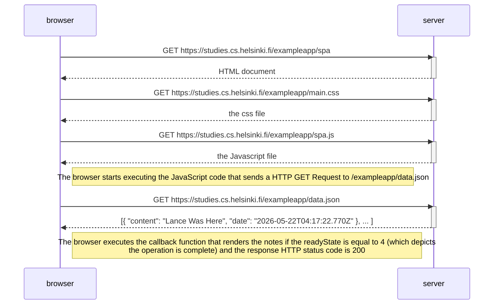

# Single Page App

```mermaid
sequenceDiagram
    participant browser
    participant server

    browser->>server: GET https://studies.cs.helsinki.fi/exampleapp/spa
    activate server
    server-->>browser: HTML document
    deactivate server

    browser->>server: GET https://studies.cs.helsinki.fi/exampleapp/main.css
    activate server
    server-->>browser: the css file
    deactivate server

    browser->>server: GET https://studies.cs.helsinki.fi/exampleapp/spa.js
    activate server
    server-->>browser: the Javascript file
    deactivate server

    Note right of browser: The browser starts executing the JavaScript code that sends a HTTP GET Request to /exampleapp/data.json

    browser->>server: GET https://studies.cs.helsinki.fi/exampleapp/data.json
    activate server
    server-->>browser: [{ "content": "Lance Was Here", "date": "2026-05-22T04:17:22.770Z" }, ... ]
    deactivate server

    Note right of browser: The browser executes the callback function that renders the notes if the readyState is equal to 4 (which depicts<br/>the operation is complete) and the response HTTP status code is 200

```