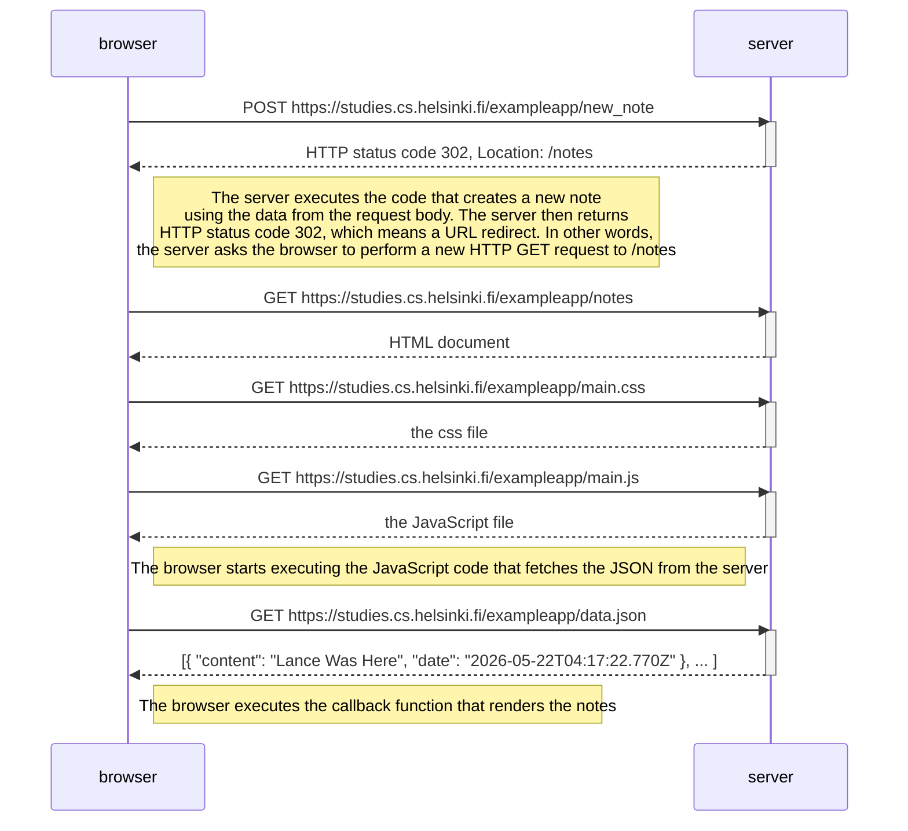

# Creating A New Note

```mermaid
sequenceDiagram
    participant browser
    participant server

    browser->>server: POST https://studies.cs.helsinki.fi/exampleapp/new_note
    activate server
    server-->>browser: HTTP status code 302, Location: /notes
    deactivate server

        Note right of browser: The server executes the code that creates a new note<br/>using the data from the request body. The server then returns<br/>HTTP status code 302, which means a URL redirect. In other words,<br/>the server asks the browser to perform a new HTTP GET request to /notes

    browser->>server: GET https://studies.cs.helsinki.fi/exampleapp/notes
    activate server
    server-->>browser: HTML document
    deactivate server

    browser->>server: GET https://studies.cs.helsinki.fi/exampleapp/main.css
    activate server
    server-->>browser: the css file
    deactivate server

    browser->>server: GET https://studies.cs.helsinki.fi/exampleapp/main.js
    activate server
    server-->>browser: the JavaScript file
    deactivate server

    Note right of browser: The browser starts executing the JavaScript code that fetches the JSON from the server

    browser->>server: GET https://studies.cs.helsinki.fi/exampleapp/data.json
    activate server
    server-->>browser: [{ "content": "Lance Was Here", "date": "2026-05-22T04:17:22.770Z" }, ... ]
    deactivate server

    Note right of browser: The browser executes the callback function that renders the notes
```